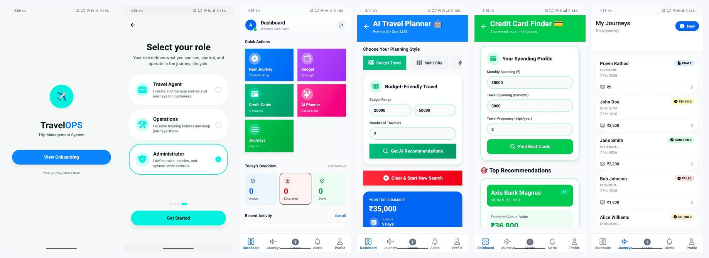
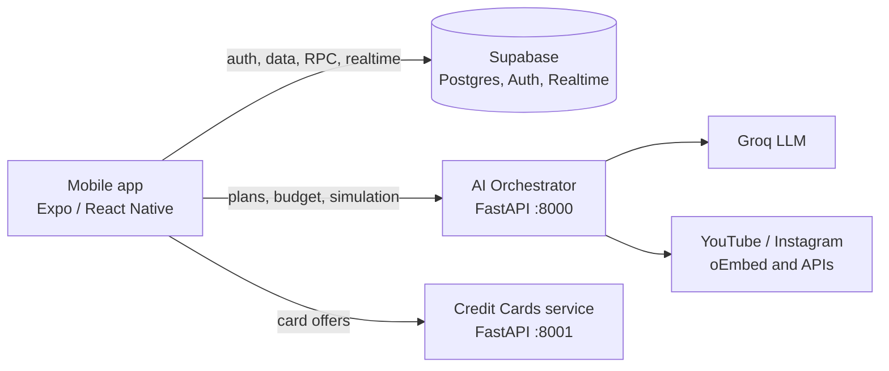
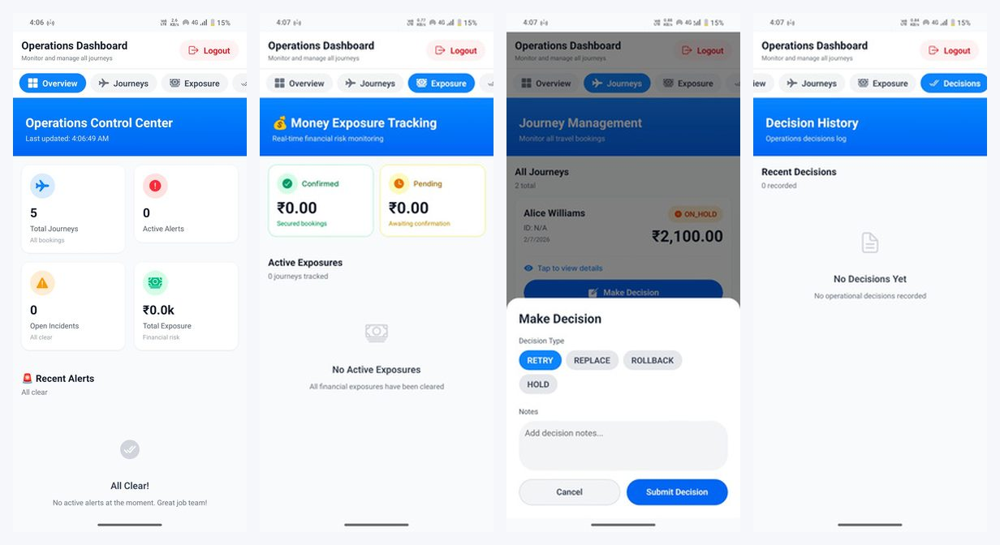
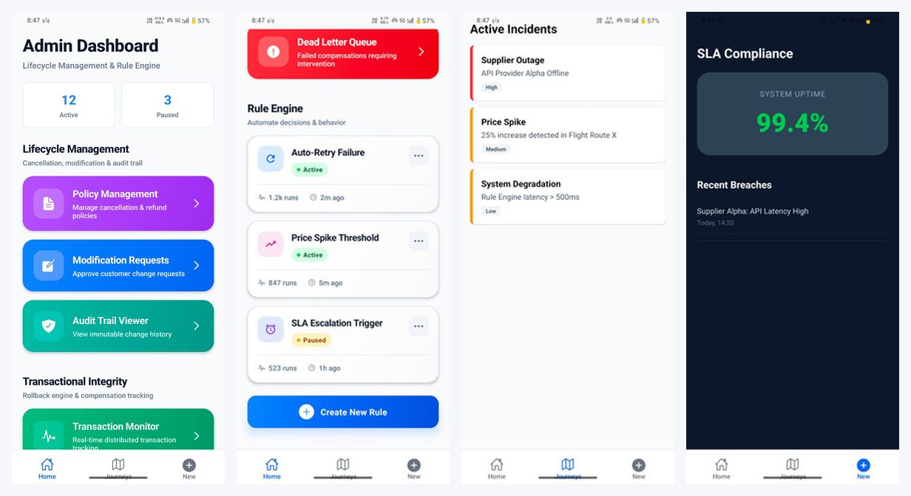

# TravelOps

**AI-assisted travel journey management for agents, operations teams and administrators.**


Built by **Team Melt Down** for Hack Fusion Hackathon 2026.



## Contents

1. [Problem and solution](#problem-and-solution)
2. [Features and status](#features-and-status)
3. [Architecture](#architecture)
4. [AI agents and services](#ai-agents-and-services)
5. [Backend](#backend)
6. [Frontend](#frontend)
7. [Quick start](#quick-start)
8. [Database setup](#database-setup)
9. [Configuration](#configuration)
10. [Project lifecycle (DPLC)](#dplc-development--product-life-cycle)
11. [Known limitations and roadmap](#known-limitations-and-roadmap)
12. [Further reading](#further-reading)

## Problem and solution

A single trip touches many independent systems: flights, hotels, transfers and payments. When one step fails (a hotel confirms while the flight does not), the traveller is left with a half-booked journey and operations teams have to repair it by hand.

TravelOps tackles this end to end:

- **Agents** build multi-city itineraries, budget packages and credit-card-aware offers with help from an LLM.
- **Operations** see journeys, money exposure and alerts in one place, and decide to retry, replace, hold or roll back.
- **Admins** manage cancellation policies, modification requests, audit trails, distributed transactions and the dead-letter queue.
- A **saga-style rollback engine** compensates completed steps in reverse order when a later step fails.

## Features and status

This is a prototype. The table is explicit about what runs on real data and what is demo content.

| Area | Feature | Status |
|------|---------|--------|
| Agent | Multi-city AI trip planner (budget, multi-city, quick trip, influencer URL modes) | Implemented |
| Agent | Destinations extracted from a YouTube or Instagram link | Implemented |
| Agent | Budget Smart packages (LLM generated, rule-based fallback) | Implemented |
| Agent | Credit-card recommendations and trip savings | Implemented (static card data) |
| Agent | Package search, journey list, notifications | Implemented (Supabase RPC) |
| Ops | Dashboard: journeys, money exposure, alerts, decisions | Implemented (Supabase) |
| Ops | Risk scoring and auto-created alerts and incidents (SQL triggers) | Implemented |
| Ops | Transaction simulator with reverse compensation | Implemented (in-memory demo) |
| Admin | Cancellation policy management, modification approvals | Implemented (Supabase RPC) |
| Admin | Audit trail, transaction monitor, manual rollback, dead-letter queue | Implemented (Supabase RPC) |
| Admin | SLA breach and incident screens, rule list | Demo (mock data) |
| Platform | Sign-in, role enforcement | Planned |
| Platform | Rule engine, agent analytics, supplier loyalty badges | Planned |

## Architecture



| Layer | Technology | Responsibility |
|-------|-----------|----------------|
| Mobile client | Expo 54, React Native 0.81, expo-router, NativeWind | Role-based screens for Agent, Ops and Admin |
| AI services | FastAPI, Pydantic, Groq SDK, geopy | Planning, recommendations, simulation |
| Data | Supabase Postgres with SQL functions and triggers | Journeys, exposure, alerts, lifecycle, rollback |

Typical request: the app sends a trip request to `/api/v1/plan/enhanced`, the orchestrator plans each leg (using the LLM where available, rules otherwise), and the app then calls the credit-card service to suggest the best card for that trip.

## AI agents and services

| Component | Code | What it does |
|-----------|------|--------------|
| **Travel Orchestrator Agent** | `Backend/ai_orchestrator/agents/orchestrator.py` | Plans multi-city trips. Measures leg distances with geodesic distance over 15 supported Indian cities, splits the budget by preference (cheapest, comfort, balanced, fastest), picks transport per leg, picks hotel tier by nightly budget, adds local transport, and returns a confidence score. |
| **Groq LLM Service** | `services/groq_service.py` | Wraps the Groq chat API with JSON-only prompts for transport choice, trip insights, UI summaries and destination extraction. Every call has a rule-based fallback, so the app still works if the LLM is off or fails. |
| **Social Media Fetcher** | `services/social_media_fetcher.py` | Reads YouTube (Data API when a key is set, otherwise oEmbed) and Instagram (oEmbed) links, with URL keyword hints as a last resort. The result feeds destination extraction. |
| **Budget Smart Agent** | `api/budget.py` | Asks the LLM for 5-8 packages within a budget range, validates and filters them, computes savings percent, and falls back to a curated list. Also adds a short budget analysis and a travel tip. |
| **Transaction Simulator (saga)** | `api/simulation.py` | Runs a five-step booking (flight, hotel, local transport, payment, confirmation) under five scenarios. On failure it compensates completed steps in reverse order. |
| **Credit Card Recommender** | `Backend/credit_cards/main.py` | Estimates annual value from spend, reward rate, travel multiplier, cashback, joining bonus and fee, and ranks cards. For a trip it adds offer savings and returns the top three. |

Transport selection in detail: the LLM proposes a mode and cost; if that is missing or invalid, a distance ladder applies (flight over 800 km, train over 400 km, bus or train over 150 km, otherwise cab). If the cost exceeds 70% of the leg budget, the plan downgrades (flight to train, train to bus).

## Backend

### AI Orchestrator (`Backend/ai_orchestrator`, port 8000)

Interactive docs: `http://localhost:8000/docs`

| Method | Path | Purpose |
|--------|------|---------|
| GET | `/`, `/health` | Health and active simulation count |
| POST | `/api/v1/plan` | Multi-city plan (2+ cities, minimum budget per city and traveller) |
| POST | `/api/v1/plan/enhanced` | Plan plus LLM insights and UI summary |
| POST | `/api/v1/plan/simulate` | Plan with a step-by-step trace |
| GET, DELETE | `/api/v1/simulation/{id}`, `/api/v1/simulations` | Stored simulations |
| GET | `/api/v1/cities`, `/api/v1/distance/{city1}/{city2}` | Supported cities and distances |
| POST | `/api/v1/insights` | LLM trip insights |
| GET | `/api/v1/llm/status` | LLM enabled flag and model |
| POST | `/api/v1/budget/recommendations` | Budget Smart packages |
| GET | `/api/v1/budget/destinations`, `/api/v1/budget/budget-tips` | Destinations and tips |
| POST | `/api/v1/transactions/simulate`, `/simulate/batch` | Saga simulation |
| GET | `/api/v1/transactions/scenarios` | Available failure scenarios |

### Credit Cards service (`Backend/credit_cards`, port 8001)

| Method | Path | Purpose |
|--------|------|---------|
| GET | `/api/v1/cards`, `/api/v1/cards/{id}` | Card catalogue and details |
| POST | `/api/v1/recommendations` | Top cards by estimated annual value |
| POST | `/api/v1/recommend-for-trip` | Top cards for a specific trip cost |
| POST | `/api/v1/calculate-rewards` | Rewards for a spend amount |
| GET | `/api/v1/offers`, `/api/v1/travel-benefits/{id}` | Offers and travel benefits |

### Data layer (`Backend/database`, `Backend/functions`)

| Group | Tables (examples) | Notes |
|-------|-------------------|-------|
| Operations | `journeys`, `journey_items`, `money_exposure`, `ops_alerts`, `ops_decisions`, `ops_actions`, `incidents`, `admin_notifications` | Triggers create exposure rows, alerts and incidents and recompute totals |
| Profiles | `profiles` | Role (`agent`, `ops`, `admin`) created on sign-up |
| Customer features | `customers`, `destinations`, `packages`, `flights`, `notifications`, analytics tables | Back the agent recommendation and search RPCs |
| Lifecycle | `cancellation_policies`, `modification_requests`, `journey_audit_log`, `refund_calculations` | Audit log is immutable |
| Rollback engine | `distributed_transactions`, `transaction_steps`, `compensation_actions`, `rollback_dead_letter_queue` | Compensation runs in reverse; exhausted retries land in the dead-letter queue |

Risk scoring: without a budget, exposure above 50k is HIGH and above 20k is MEDIUM. With a budget, exposure above 80% of it is HIGH and above 50% is MEDIUM.

## Frontend

Expo app in `Frontend/`, using file-based routing with one route group per role.

| Role | Route group | Main screens |
|------|-------------|--------------|
| Agent | `app/(agent)` | Dashboard, AI planner, budget packages, credit card finder, trend search, journeys, notifications, profile |
| Ops | `app/(ops)` | Operations dashboard (overview, journeys, exposure, decisions, transactions, DLQ, simulation), decision and rollback flow, incidents, journey details |
| Admin | `app/(admin)` | Policy management, modification requests, audit trail, transaction monitor, dead-letter queue, incidents, SLA view |

Supporting folders: `services/` (API clients for the two FastAPI services), `lib/` (Supabase client with SecureStore, operations API), `component/` (shared UI kit), `hooks/`, `types/`.





## Quick start

**Prerequisites:** Node 18+, Python 3.10+, a [Supabase](https://supabase.com) project, a free [Groq API key](https://console.groq.com/keys), and Expo Go on your phone.

```bash
git clone https://github.com/Tejas-Santosh-Nalawade/Travel-Ops.git
cd Travel-Ops
```

**1. Database:** follow [Database setup](#database-setup).

**2. Backends** (run in `Backend/ai_orchestrator` and `Backend/credit_cards`):

```bash
python -m venv .venv
source .venv/bin/activate        # Windows: .venv\Scripts\activate
pip install -r requirements.txt
cp .env.example .env             # ai_orchestrator: set GROQ_API_KEY
uvicorn main:app --host 0.0.0.0 --port 8000   # use 8001 for credit_cards
```

**3. Mobile app:**

```bash
cd Frontend
npm install
cp .env.example .env             # Supabase URL/key and your computer's LAN IP
npx expo start                   # scan the QR code with Expo Go
```

Phone and computer must share a Wi-Fi network; use the computer's IP, not `localhost`.

Android APK: `cd Frontend && npx eas build -p android --profile preview`.

## Database setup

Run these in the Supabase SQL editor, in this order (derived from table dependencies):

1. `Backend/database/schemas/complete-schema.sql`
2. `Backend/database/schemas/database-profiles-setup.sql`
3. `Backend/database/schemas/complete-features-schema.sql`
4. `Backend/database/triggers/automated-actions.sql`
5. `Backend/database/functions/operations.sql` and `features-api.sql`
6. `Backend/database/schemas/lifecycle-management-schema.sql`, then `Backend/functions/lifecycle-management-api.sql`
7. `Backend/database/schemas/rollback-engine-schema.sql`, then `Backend/functions/rollback-engine-api.sql`
8. Optional data: `sample-data.sql`, `dummy-data.sql`

Notes: `database-schema.sql` is an older copy of `complete-schema.sql`; do not run it. `DEMO_DATA_SETUP.sql` does not match the current schema and needs rework before use. The order has not been re-verified on a fresh project.

## Configuration

| Variable | Where | Description |
|----------|-------|-------------|
| `GROQ_API_KEY` | `Backend/ai_orchestrator/.env` | **Required** for LLM features |
| `GROQ_MODEL` | same | Defaults to `mixtral-8x7b-32768` in `config.py`; confirm it is still offered by Groq and change if not |
| `SUPABASE_URL`, `SUPABASE_KEY` | same | Supabase project |
| `YOUTUBE_API_KEY` | same | Optional, richer YouTube data |
| `EXPO_PUBLIC_SUPABASE_URL`, `EXPO_PUBLIC_SUPABASE_KEY` | `Frontend/.env` | Supabase URL and anon key |
| `EXPO_PUBLIC_API_URL` | `Frontend/.env` | Orchestrator URL, e.g. `http://192.168.1.10:8000` |
| `EXPO_PUBLIC_CREDIT_API_URL` | `Frontend/.env` | Credit-card service URL (port 8001) |

`.env` files are git-ignored. Never commit keys; copy from `.env.example`.

## DPLC (Development & Product Life Cycle)

Deck: [Canva DPLC](https://www.canva.com/design/DAHApX7j9v4/A8maVIZLdyQIEfwvSY__sw/edit)

| Phase | Output | Where |
|-------|--------|-------|
| Plan | Problem, roles, scope | `TravelOps.pptx` |
| Design | Architecture, data model, wireframes | [ARCHITECTURE.md](ARCHITECTURE.md), `Backend/database/`, `docs/images/` |
| Build | Schema, FastAPI agents, Expo app | `Backend/`, `Frontend/` |
| Test | API scripts, failure simulation, lint | `Backend/ai_orchestrator/test_*.py`, `npm run lint` |
| Deploy | Python host for APIs, EAS for the app | `Frontend/eas.json` |
| Monitor and iterate | Dead-letter queue, rollback and incident dashboards | Ops and Admin areas |

## Known limitations and roadmap

Tracked openly so reviewers know what to expect:

- **No sign-in yet.** The role is picked on the onboarding screen and not enforced; Supabase policies allow any authenticated user. Real auth and route guards come first.
- **Mock admin screens.** SLA breach, incident list and the rule list use static data.
- **Ops decision flow** writes to a `decisions` table that the schema does not define (the schema has `ops_decisions`), and the rollback screen animates rather than calling the saga RPCs.
- **Planner results** are not yet saved into `journeys`.
- **Simulator** dead-letter branch never triggers; `/plan/enhanced` drops the insights fields from its response model; `/plan/optimize` returns 501.
- **Notifications realtime** filter is built incorrectly and needs fixing.
- **Hardcoded LAN IPs** remain in two screens and should use `EXPO_PUBLIC_API_URL`.
- **Repo hygiene:** tracked `node_modules`, caches and scratch files in `Backend/ai_orchestrator` should be untracked.

Planned: real auth with role guards, persisting AI plans, a rule engine for SLA and escalation, agent and supplier analytics, automated tests and CI.

## Further reading

- [ARCHITECTURE.md](ARCHITECTURE.md)
- [Budget AI guide](Backend/ai_orchestrator/BUDGET_AI_GUIDE.md)
- [Simulation guide](Backend/ai_orchestrator/SIMULATION_DEMO_GUIDE.md)
- [Social media setup](Backend/ai_orchestrator/SOCIAL_MEDIA_SETUP.md)
- [Mobile quick start](Frontend/QUICK_START.md)

## Team

Team Melt Down. © 2026, all rights reserved.
